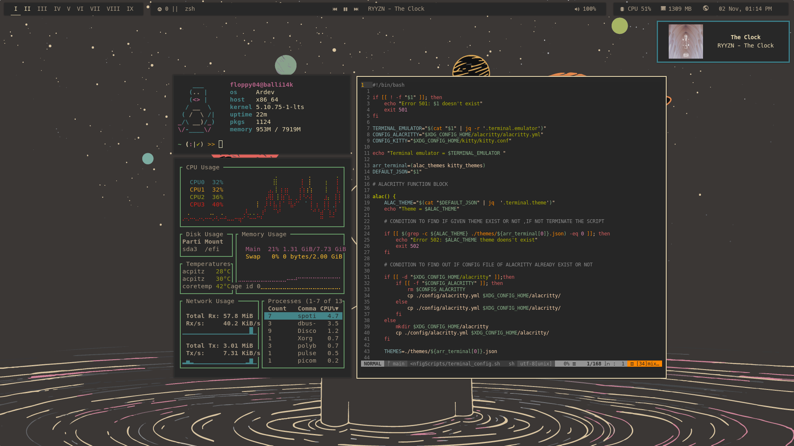
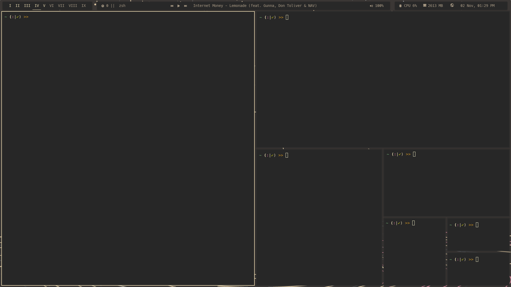

# ArdevLinux
Ardev Linux is an Arch Linux based distribution which aims to simplify the installation and confirguration of your system. It works by invoking a set of installation and configuration scripts as and when required.

## Packages used
- Windowing System - Xorg
- Window Manager - BSPWM
- Programs Menu - Rofi
- Shell - Bash/Zsh
- Terminal Emulator - Alacritty/Kitty

## Showcase

## Todo
Ardev Linux is focusing more on improving its already existing packages and features instead of adding more plugins.
Things we are currently working and actively looking for contributions on:
- Add [i3wm](https://i3wm.org/) as an option for Window Manager
- Include more theme options
- Include more font options
